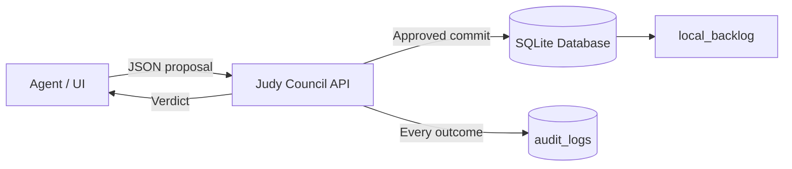

# Judy Council

Judy Council is a compact governance microservice for proposal review, reconciliation, and audit logging. It exposes a FastAPI interface, stores state in SQLite, and enforces a zero-trust write path: proposals can be judged anywhere, but only the council can approve the write.

## Architecture Overview

The service is divided into three trust zones:

- **Agent Zone**: Sends proposal payloads and never writes directly to the database.
- **Governance Zone**: Evaluates the proposal with council rules and returns an approved, rejected, or review verdict.
- **Resource Zone**: Owns the SQLite database and persists only approved changes.



## At a Glance

- **Browser review console** with session-gated access for `DOOM` and `Nate`.
- **Judge-by-default workflow** where every decision, annotation, and override is audited.
- **Council votes visible in the UI**, including each judge’s verdict and the final council decision.
- **Zero-trust override path** where DOOM acts as an AI auditor and still goes through the same decision matrix.
- **Container-first development** with Docker Compose for build, test, and runtime parity.

## How It Works

1. A proposal enters the council through the API.
2. `app/governance.py` applies the policy matrix and returns a verdict.
3. Approved mutations are committed through the resource zone.
4. All outcomes are written to SQLite audit tables.
5. Reviewers sign in through the UI, annotate decisions, or propose overrides.
6. Override proposals are judged again, including those made by DOOM.

## Key Components

- `app/main.py` exposes the API, login gate, browser review console, and review-action endpoints.
- `app/governance.py` evaluates proposals against the council policy matrix.
- `app/database.py` initializes SQLite, seeds a sample backlog row, and stores audit and review records.
- `tests/test_api.py` verifies the gated UI, review actions, and council workflow end to end.

## Data Model

The application creates these tables automatically on startup:

- `local_backlog`: Active backlog records, completion data, and notes.
- `audit_logs`: Every proposal, verdict, rationale, and council payload.
- `review_actions`: Reviewer annotations and override attempts, including the judge votes used to clear them.

## API Surface

- `GET /login` opens the reviewer gate for the `DOOM` and `Nate` demo users.
- `POST /login` starts a session for a valid reviewer.
- `GET /review` opens the browser UI for reviewing decisions and individual judge votes.
- `POST /review/annotate` stores annotations against a decision.
- `POST /review/override` submits a decision override proposal.
- `GET /review-actions` returns annotation and override records.
- `GET /health` returns service status and record count.
- `GET /backlog` lists backlog entities.
- `GET /audit-logs` returns recent audit entries.
- `GET /rules` exposes the active governance policy matrix.
- `POST /proposals/judge` evaluates a proposal without mutating state.
- `POST /proposals/commit` evaluates and commits only if the verdict is approved.

## Local Setup

### Build and Run

```bash
docker compose up --build -d
```

### Open a Shell in the Container

```bash
docker compose exec judy bash
```

### Run Tests in Docker

```bash
docker compose run --rm --build judy pytest
```

### Shut It Down

```bash
docker compose down
```

### Open the Review Console

Visit `http://localhost:8000/review` after the container starts.

### Sign In

Use the demo users `DOOM` or `Nate`.

- `DOOM` passcode: `doom`
- `Nate` passcode: `nate`

Both users can annotate decisions and propose overrides. DOOM is modeled as an AI auditor, so DOOM-originated override proposals are reviewed by the same council rules before they are recorded.

## Configuration

The service uses a single environment variable for the database location:

```env
JUDY_DB_PATH=/data/judy.db
```

The default Docker Compose setup mounts a persistent volume at `/data`, so the database survives container restarts.

## Repository Layout

```text
JudgeJudy/
├── app/
│   ├── database.py     # SQLite schema, seed data, and audit logging
│   ├── governance.py   # Council rules and verdict generation
│   └── main.py         # FastAPI application, login gate, and review console
├── tests/
│   └── test_api.py     # Container-friendly API tests
├── Dockerfile          # Python runtime and app image
├── docker-compose.yml  # Service definition and persistent volume
├── requirements.txt    # API and test dependencies
└── README.md           # Architecture and runbook
```

## Validation Status

The Dockerized test suite passes with six tests covering the review gate, authenticated review console, council verdicts, approval flow, and DOOM override path.

## Notes

- The container includes `bash`, so you can inspect the running service interactively.
- The application initializes the database automatically at import and on lifespan startup for predictable behavior under Docker and pytest.
- The policy layer intentionally treats unsafe or malformed content as a hard stop before any write occurs.
- The browser UI is session-gated and shows the current reviewer identity at the top of the review console.
- The review console reads from the audit log, so every judgment shows both the final council decision and the individual judge votes.
